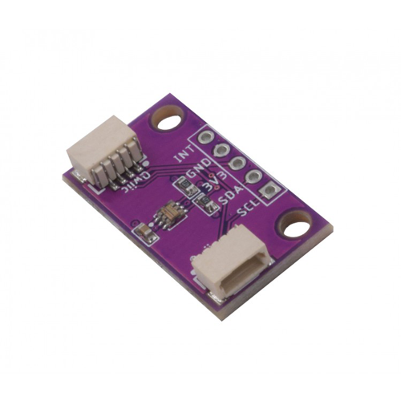

# Zio Qwiic Light Sensor (TSL2561)

> This product can be available for purchase [here](https://www.smart-prototyping.com/Zio-Qwiic-Light-Sensor-TSL2561).

#### Description

This inexpensive precision light sensor is, although compact in size, is robust enough to output the exact luminance rate for visible light (Approximates Human Eye Response), invisible light (IR), and full light (both visible and invisible light) from up to 0.1 - 40,000+ lux on the fly! 

With [Qwiic](https://www.smart-prototyping.com/Qwiic.html) installed you can effortlessly prototype your projects without soldering and complicated wiring. We also added I2C pins for connecting to modules outside the qwiic domain.

Especially reliable for projects and applications involving Street light controlling system, monitoring luminosity of the living environment, or simply doing research on light brightness. 

All in all, if you need a light sensor in a project, this is definitely the right choice!

#### Specification

* Dynamic range (Lux): 0.1 to 40,000 Lux
* Voltage range: 2.7-3.6V
* Interface: I2C
* I2C Address: 0x39 (Default), 0x29, 0x49, selectable with jumpers
* Module dimension: 14.4x 25.4mm
* Weight: 1.3g

#### Links

* [PCB Source file and Gerber file](https://github.com/ZIOCC/Zio-Qwiic-Light-Sensor-TSL2561)
* [PCB Schematic](https://github.com/ZIOCC/Zio-Qwiic-Light-Sensor-TSL2561/blob/master/Zio%20Qwiic%20Light%20Sensor%20TSL2561%20Schematic%20PDF.pdf)
* [Demo Code and library](https://github.com/adafruit/TSL2561-Arduino-Library)

> ###### About Zio
> Zio is a new line of open sourced, compact, and grid layout boards, fully integrated for Arduino and Qwiic ecosystem. Designed ideally for wearables, robotics, small-space limitations or other on the go projects. Check out other awesome Zio products [here](https://www.smart-prototyping.com/Zio).

